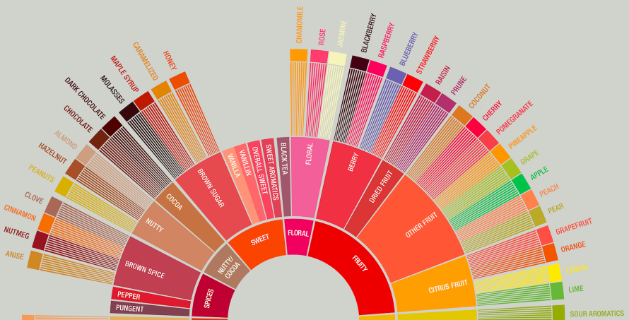
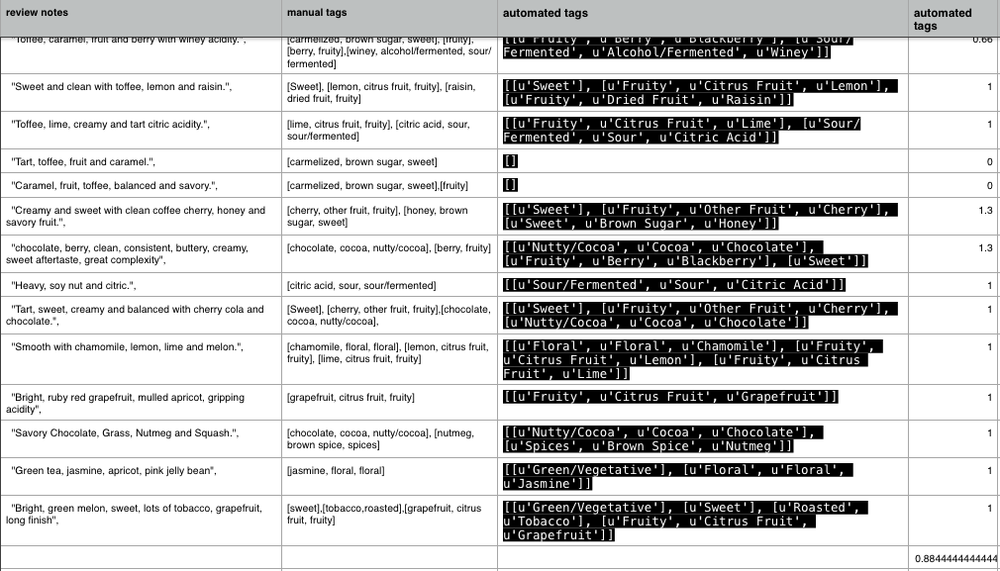

## Introduction

Classification and tagging of text samples has a number of applications in the industry: customer service, processing of text orders or archiving, to name just a few. Doing it by hand takes a lot of time and requires sustained attention😴. Thankfully, repetitive and boring tasks are one of the things computers are **really** good at 💻 💯. 

The goal of this library is to automatically tag flavor categories from the [SCAA flavor wheel](http://www.scaa.org/chronicle/wp-content/uploads/2016/01/SCAA_FlavorWheel.01.18.15.jpg) in text samples provided either as an input in the terminal or as a list of notes in a .json file. Specific use cases are described below.

## Usage

There are two ways to use functions in this repo. The first use case applies to a situation when you want to quickly tag a few notes. When you call the following function in the terminal from <code>/CoffeeFlavors/</code>directory:

    python src/coffee_flavors.py   

and once a message <code>Enter the sentence:</code> appears type in your note, e.g.:

    Sweet grapefruit, lemon-lime and fruit punch with citric, tartaric acidity and a heavy mouthfeel.

it will return a list of lists containing tags from the flavor wheel ('u' means it is in unicode):

<pre>
    [[u'Sweet'],
    [u'Fruity', u'Citrus Fruit', u'Grapefruit'],
    [u'Fruity', u'Citrus Fruit', u'Lemon'],
    [u'Fruity', u'Citrus Fruit', u'Lime'],
    [u'Sour/Fermented', u'Sour', u'Citric Acid']]
</pre>

You can also call the function <code>coffee_flavors(text)</code> from within another function (or a Jupyter Notebook) and it will return a list like above. This use case is more practical when you have a number of notes which need to be tagged. For example, if you have a .json file containing a list of notes from which you want to tag first 20, you can use it in the following way:

    notes = open_json(filepath='tasting_notes.json')
    tags = [coffee_flavors(note) for note in notes[0:19]]

## Validation

In order to validate my approach I manually tagged 18 review notes and compared it to the output of the <code>coffee_flavors.py</code>, which overalpped in 88%. Examining the errors was interesting. I noticed, for example, that *caramel* and *fruit* (but not *fruity*) was consistently missing in the output of the <code>coffee_flavors.py</code> while *green tea* was falsely tagged as *Green / Vegetative*. I discuss why these errors most likely occur and how to fix them in the section "Further steps".

## Next steps
There is always something to improve. I think of this code as a prototype which deals with simplest cases. Let me walk you through the matching process.

After you type your note, it gets parsed into individual tokens, lemmatized and stemmed (see <a href="http://www.nltk.org"> nltk </a> and <a href="https://spacy.io"> spaCy </a>  documentation for details). Next it gets matched to the entries of a list of dictionaries with similarly lemmatized and stemmed tags from the [SCAA flavor wheel](http://www.scaa.org/chronicle/wp-content/uploads/2016/01/SCAA_FlavorWheel.01.18.15.jpg). It is a simple match, and one of interesting improvements to this process would involve fuzzy matching using vector representations of each tag. 

As you noticed in the validation section, this simple matching leads to misses or false positives and doesn't deal with simple bigrams such as "green tea" (falsely tagging *green* as *Green / Vegetative*) or negations "not sour" and doesn't recognize *apricot* as similar to *peach* (I know, they *are* different but one might argue that someone who wrote a review online might not be aware or care about such distinctions:). It also doesn't deal well with spelling errors - <a href="https://github.com/mattalcock/blog/blob/master/2012/12/5/python-spell-checker.rst"> here </a> is an interesting blog post about an approach I would take to fix that. 

Another issue with this code is that it would not scale well. Matching the entry words with list of dictionaries works painfully slow, as it iterates through the list up to 3 times. One way to decrease the *time complexity* of this solution would be to redesign data storage. One excellent idea that I had *after* I implemented the current solution would decrease it up to three times. Instead of using a list of dictionaries for each entry, we could have only one dictionary where <code>keys</code> contain stemmed and lemmatized tags and <code>values</code> unedited tags and their corresponding parent tags, such that key <code>"molasses"</code> would contain values <code>"molass"</code> and <code>"brown sugar"</code>. Tags from the highest level would have <code>None</code> instead of parent tag, and the search algorithm would search for all parents until it stumbled upon <code>None</code>.

These are some suggestions of possible improvements which due to time constraints I couldn't follow - but it was a great fun to work on this project. 

*Enjoy!*

## Dependencies and requirements

1. <a href="https://www.python.org/"> Python</a> (2.7)
2. <a href="http://www.nltk.org"> nltk </a> (3.0.5)
3. <a href="https://spacy.io"> spaCy </a> (1.7.5)

To install the requirements with pip (except for Python), type in the main directory:

<code> pip install -r requirements.txt </code>

## Testing

To test the code to make sure it works run the following command in your terminal shell from the <code>/CoffeeFlavors/</code>directory:

    python -m unittest tests/test_utitlies  

You will then see a report on the testing results.

