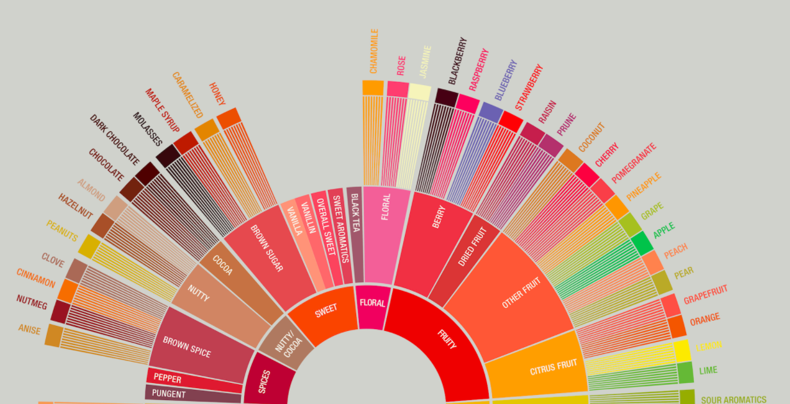
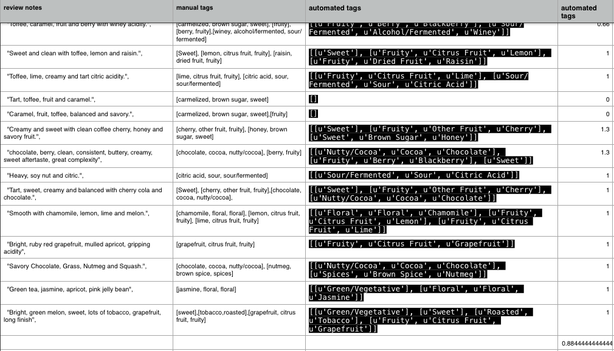

To do:

1. detailing installation, usage and contribution instructions.

requirements
test
tradeoffs
time spent
egg packaging

## Introduction

Classification and tagging of text samples has a number of applications in the industry: customer service, processing of text orders or archiving, to name just a few. Doing it by hand takes a lot of time and requires sustained attention😴. Thankfully, repetitive and boring tasks are one of the things computers are **really** good at 💯💻. 

The goal of this library is to automatically tag flavor categories from the [SCAA flavor wheel](http://www.scaa.org/chronicle/wp-content/uploads/2016/01/SCAA_FlavorWheel.01.18.15.jpg) in text samples provided either as an input in the terminal or as a list of notes in a .json file. Specific use cases are described below.

## Installation and requirements

1. <a href="https://www.python.org/"> Python</a> (2.7)
2. <a href="http://www.nltk.org"> NLTK </a> 
3. <a href="https://spacy.io"> spaCy </a> 

To install the requirements with pip (except for Python), type in the main directory:

<code> pip install -r requirements.txt </code>

## Usage

There are two ways to use functions in this repo. The first use case applies to a situation when you want to quickly tag a few notes. When you call the following function in the terminal from <code>/CoffeeFlavors/</code>directory:

    python coffee_flavors.py   

and type in a note:

    Sweet grapefruit, lemon-lime and fruit punch with citric, tartaric acidity and a heavy mouthfeel.

it will return a list of lists containing tags from the flavor wheel ('u' means it is in unicode):

<pre>
    [[u'Sweet'],
    [u'Fruity', u'Citrus Fruit', u'Grapefruit'],
    [u'Fruity', u'Citrus Fruit', u'Lemon'],
    [u'Fruity', u'Citrus Fruit', u'Lime'],
    [u'Sour/Fermented', u'Sour', u'Citric Acid']]
</pre>

You can also call the function <code>/coffee_flavors(text)/</code> from within another function and it will return a list like above. This use case is more practical when you have a number of notes which need to be tagged.  

## Testing

To test the code to make sure it works run the following command in your terminal shell from the <code>/CoffeeFlavors/</code>directory:

	py.test tests	

You will then see a report on the testing results.

## Validation

In order to validate my approach I manually tagged 18 review notes and compared it to the output of the <code>/coffee_flavors.py/</code>, which overalpped in 88%. Examining the errors was interesting. I noticed, for example, that *caramel* and *fruit* (but not *fruity*) was consistently missing in the output of the <code>/coffee_flavors.py/</code> while *green tea* was falsely tagged as *Green / Vegetative*. I discuss why these errors most likely occur and how to fix them in the section "Further steps".

To do with the actual code:
input output

testing
egg / wheel packaging 

What would I do if I had more time? [Not supported in the library]:
- spelling errors (https://github.com/mattalcock/blog/blob/master/2012/12/5/python-spell-checker.rst)
- bigrams (this includes negations and phrases such as "dark chocolate")
- tree structure for flavor_table. or one large dictionary with keys processed flavors and values of original flavors and parent. highest level flavors have parent 'None', and then have a find_label function such that it looks for a parent as long as it does not equal to None.
- synonyms / fuzzy matching (e.g. toffee / carmelized, apricot / peach)
- case of green tea (tagged as green / vegetative)
